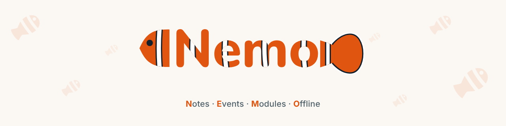
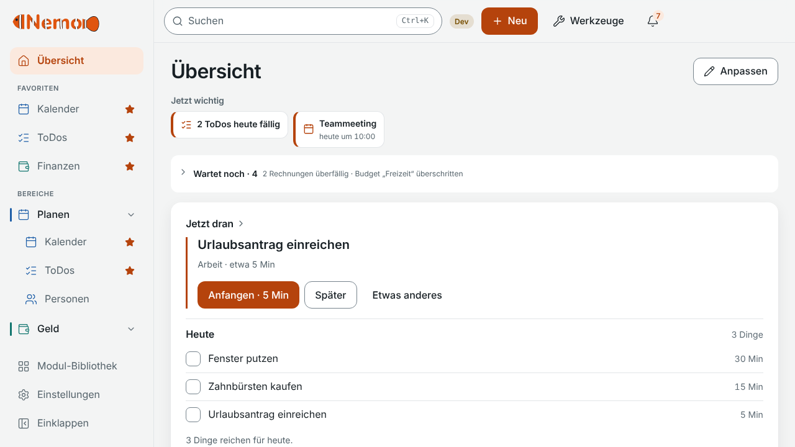

<strong>English</strong> | <a href="README.de.md">Deutsch</a>

  <picture>
    <source media="(prefers-color-scheme: dark)" srcset="docs/brand/header.png">
    
  </picture>

<h1 align="center">Nemo</h1>

Calendar, to-dos, finances, passwords and more in one app. Your data stays on your device.

  
  
  
  

  
  

The buttons download the latest <strong>stable</strong> version. Pre-releases (beta) and all changes: <a href="https://github.com/SGNemo/schweizer-taschenmesser/releases">Releases</a>. The app interface is German today; more languages are on the way.

  <picture>
    <source media="(prefers-color-scheme: dark)" srcset="docs/screenshots/readme/dashboard-dark.png">
    
  </picture>

## What Nemo does

You turn modules on one by one in the **module library**. Everything works offline.

| Area | Modules |
|---|---|
| Plan | **Calendar** (month, week, day, events from other modules, reminders even when the app is closed), **To-dos** (lists, priorities, subtasks, recurrence, "Someday"), **People** (birthdays and gifts) |
| Money | **Finances** (accounts, transactions, categories, bank statement import), **Invoices**, **Subscriptions**, **Budgets & savings goals** |
| Remember | **Notes**, **Saved** and **Bookmarks** (links, reading, watching, places), **Lists** (shopping, packing, checklists), **Documents** (IDs, contracts, warranties with deadlines) |
| Secure | **Accounts**: password vault with Argon2id/AES-256, TOTP, generator, biometrics. Invisible to AI, search and import |
| Home & PC | **Pantry** (expiry dates, restocking), **This PC** (Windows app only: analyse space, clean up safely, system info) |
| Extras | **Tools** (calculator, percent, currency, timer, QR, units, JSON, hash …), **Quick capture** (shortcut, tray, share menu) |

Plus a **command palette** (Ctrl+K) that searches all modules, and an **AI assistant** that answers simple questions itself ("What's on today?") and can pass harder ones to a provider of your choice, without sending your data. Details: [Modules and tools](docs/user/modules.md), [Search and AI](docs/user/ai-assistant.md).

## Quick start

1. **Download:** Windows portable (one file, no installation) or Android APK, buttons above.
2. **Start:** on Windows, double-click the file (the first time SmartScreen asks: "More info" → "Run anyway"). On Android, open the APK and allow installing from this source.
3. **Set up:** the setup assistant walks you through modules, vault, optional sync and AI. Everything is optional and can be changed later in the settings.

More detail, including moving from an old version and installing the PWA: [Installation](docs/user/installation.md).

## Privacy in short

- **Stored locally.** Data lives in your device's database. No account, no Nemo cloud service.
- **Sync is optional.** Only through a server you run yourself (Docker or Node), end-to-end encrypted if you want.
- **Only what you set up leaves the device.** Update check (GitHub, can be switched off), AI provider, Google connection, calendar subscription, model download, currency rates: each with what is sent and when, in the app under Settings → About Nemo → Legal and in [DATA-FLOWS](docs/legal/DATA-FLOWS.md).
- **Never your data to AI.** The assistant only sends your question, the date and field names, never entries. The vault is completely invisible to AI.
- **Signed updates.** Every update is checked against the project's key before it is applied. Details: [Security](docs/user/security.md).

<strong>Installation: Windows portable, Android, PWA</strong>

**Windows:** the exe needs no installation and no admin rights. It requires Microsoft WebView2 (usually present on Windows 10/11). Data lives in your user profile under `%LOCALAPPDATA%\io.github.sgnemo.taschenmesser`; an empty folder `data` next to the exe makes it portable (USB stick). Updates: Settings → App updates, with an automatic backup copy and signature check.

**Android:** open the APK, allow "Install from this source" for your browser or file manager, install. The app downloads later updates itself and checks the checksum; Android only accepts APKs signed with the same key.

**Dev preview:** after every change on `develop` an untested preview is built: <a href="https://github.com/SGNemo/schweizer-taschenmesser/releases/download/dev-preview/Nemo-Portable-dev.exe">Windows</a> · <a href="https://github.com/SGNemo/schweizer-taschenmesser/releases/download/dev-preview/Nemo-dev.apk">Android</a>. It is a **separate app "Nemo Dev" with its own data** and does not replace the stable app.

Full guide: [Installation](docs/user/installation.md).

<strong>Sync and backup: your own server, Docker, Tailscale, push</strong>

A small Node server (Fastify + SQLite) with token login, as a Docker image that also serves the PWA, or directly via Node. On the go, Tailscale with HTTPS is easiest; optional Web Push delivers reminders while the app is closed. Backups work as encrypted files, automatically in the installed app. Guides: [Sync server](docs/user/sync.md), [Backup](docs/user/backup.md).

<strong>AI providers: Claude, OpenAI, Gemini, Groq, OpenRouter, Mistral, Ollama</strong>

Several providers are asked in order (local → free → paid), with limits per provider and a cost overview. API keys stay encrypted on the device. An AI can deliver existing data in the app's format, and you confirm a preview. Guides: [Search and AI](docs/user/ai-assistant.md), [AI import](docs/AI-IMPORT.md).

<strong>FAQ</strong>

- **Why does Windows warn me on first start?** The exe has no purchased code-signing certificate. The update payload is still signed and checked by the app.
- **Is there an iOS version?** No. On the iPhone you can use the PWA in the browser (without push).
- **Can I export my data?** Yes, Settings → Backup creates a file with everything except credentials; the vault has its own encrypted export.
- **Isn't the project called "Schweizer Taschenmesser"?** That was the old name. Technical identifiers (package name, file paths) keep it so updates and data stay intact.
- **Is Nemo free?** Yes, MIT licence. Costs only arise with paid AI providers you set up yourself.

More: [FAQ](docs/user/faq.md).

## Support

Nemo is and stays free, and every feature is open to everyone. If you want to support the project voluntarily (any amount, one-off) via [Ko-fi](https://ko-fi.com/nemojr), you get a supporter code by e-mail as a thank-you. It unlocks purely cosmetic extras: a "thank you" badge and additional colour themes. You enter the code under Settings → About Nemo → Supporter; it is checked only on your device, without an account and without tracking. Payment happens solely on the payment provider's page; the app never handles payment data. More: [SUPPORT.md](SUPPORT.md).

## More

- [Website](https://nemo-adhd-helper.online)
- [Documentation](docs/README.md) for users and developers
- [Roadmap](docs/ROADMAP.md) with ideas for later versions
- [Changelog](CHANGELOG.md)
- [Contributing](CONTRIBUTING.md), [report a security issue](SECURITY.md), [Code of conduct](CODE_OF_CONDUCT.md)
- [License: MIT](LICENSE). The Nemo logo and name are drawn for and meant for this project; please use your own for forks.
